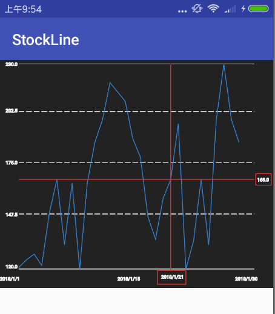

# StockLine

### 说明
    StockLine是一个折线图，也可以说是一个模仿行情分时，或者基金的一个折线图，主要是对自定义view的一个深度了解，对探索金融类软件分时趋势图也是一个帮助。主要代码都在StockLine下，里面有详细的代码注解。
### 可以学到什么
    如何去绘制一个折线图，如何去掌握行情分时图的边框，根据价格，时间来不断更新变化，及掌握十字光标的绘制。

